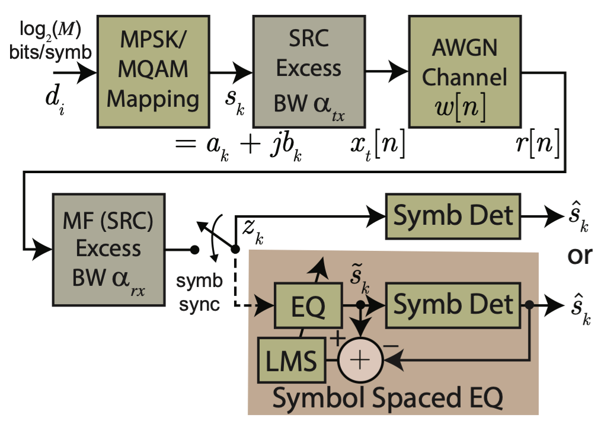
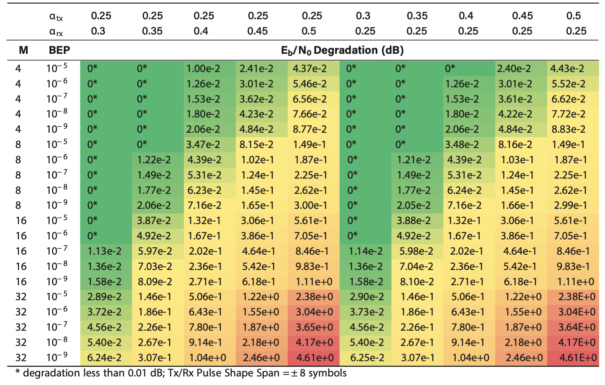
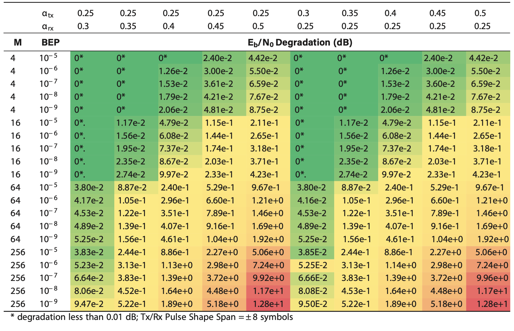

# Matched Filter Mismatch Losses in MPSK and MQAM Using Semi-Analytic BEP Modeling

This repository is the home Jupyter notebooks and Python code for exploring matched filter mismatch losses in m-ary phase-shift keying (MSK) and m-ary quadrature amplitude modulation (MQAM). A primary dependency of this software is the package `scikit-dsp-comm` (https://github.com/mwickert/scikit-dsp-comm) as well as the *scipy stack* packages `numpy`, `scipy`, and `matplotlib`.

* Scipy2020 conference proceedings paper: http://conference.scipy.org/proceedings/scipy2020/pdfs/mark_wickert_239.pdf
* Scipy2020 conference poster: http://www.eas.uccs.edu/~mwickert/Scipy2020/Scipy_2020_MPSK_MQAM_MF_Mismatch_Losses_poster.pdf 

### System Under Study Block Diagram

The content is still being organized, but the core notebook for generating the results of the Scipy 2020 conference proceedings paper is in place in the notebooks folder. A support python module, `MF_mismatch_helper.py`, will be repurposed as I will soon move the classes `MPSK_sa_BEP` and `MQAM_sa_BEP` out of the notebook and into this module.

### Heatmaps that Summarize Mismatch BEP Degradation

